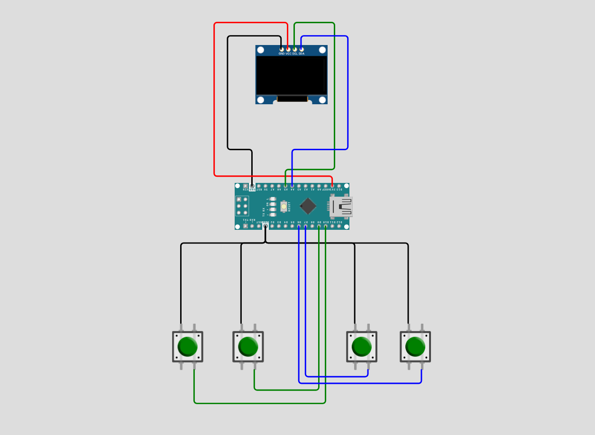

# Arduino Pacman 👻

<p align="center">
  
</p>

<p align="center">
  
  
  
  
</p>


<p align="center">
  <a href="#overview-">Overview🦤</a> •
  <a href="#features-">Features✨</a> •
  <a href="#installation-">Installation🐧</a> •
  <a href="#hardware-">Hardware🪿</a> •
  <a href="#contribution-">Contribute🤝</a> •
  <a href="#developer-guidelines-">Developer Guidelines 🐳</a>
</p>

---

## Overview 🐢

Arduino PacMan brings the classic arcade game to your microcontroller. Navigate Pac-Man through a maze, eating pellets and avoiding four ghosts — Blinky, Pinky, Inky, and Clyde — each with their own distinct AI behaviour. Grab a Power Pellet to turn the tables and eat the ghosts for bonus points. The game tracks your score across three lives, with ghosts cycling through scatter, chase, and frightened modes just like the original arcade. The game ends when all lives are lost.

---

## Features 🦤

- **Classic Pac-Man Gameplay** — Eat all 76 pellets and Power Pellets across a 10×19 maze while avoiding ghosts, with full score tracking across three lives
- **Four Unique Ghost AIs** — Blinky chases directly, Pinky targets 4 tiles ahead, Inky uses a vector calculation off Blinky's position, and Clyde switches between chasing and retreating to his corner
- **Ghost Mode Cycling** — Ghosts alternate between scatter (7s) and chase (20s) modes, reversing direction on every transition, just like the original arcade
- **Power Pellets** — Eating one triggers an 8-second frightened mode; eat multiple ghosts in a row for a combo multiplier (200 → 400 → 800 → 1600)
- **Eaten Ghost Behaviour** — Eaten ghosts turn into eyes and pathfind their way back to the ghost house before respawning
- **Staggered Ghost Exits** — Ghosts leave the house one by one at 3-second intervals (Pinky at 3s, Inky at 6s, Clyde at 9s), with Blinky starting outside
- **Directional Sprites** — Pac-Man has open/closed mouth animations for all four directions; ghosts have normal, frightened, and eaten (eyes-only) sprite states
- **Life Lost Screen** — On death, a dedicated screen displays remaining lives as heart icons before resuming
- **Compact & Efficient** — Runs on Arduino Nano on a 128×64 OLED with all sprites stored in PROGMEM

---

## Installation 🐧

### Prerequisites
- **Arduino IDE 1.8.x or higher** ([Download here](https://www.arduino.cc/en/software))
- USB cable (USB-A to USB-B for Uno, or appropriate for your board)
- Git (optional, for cloning method)

---

### Method 1: Download from GitHub Release (Easiest)

#### Step 1: Download the Code
1. Visit the [Releases page](https://github.com/aydakikio/arduino_pacman/releases)
2. Click on the latest release
3. Download the **arduino_chess.ino** file

#### Step 2: Install U8g2 Library
1. Open **Arduino IDE**
2. Go to **Sketch → Include Library → Manage Libraries...**
3. Search for `U8g2`
4. Install **U8g2 by olikraus**

#### Step 3: Open the Project
1. **File → Open**
2. Select `arduino_pacman.ino`

#### Step 4: Configure Arduino
1. Connect Arduino via USB
2. **Tools → Board → Arduino Uno**
3. **Tools → Port** → Select your Arduino port

#### Step 5: Upload
1. Click **Upload** (→) or press `Ctrl+U`
2. Game starts immediately!

---

### Method 2: Clone from GitHub

```bash
# Clone repository
git clone github.com/aydakikio/arduino_pacman.git
cd arduino_chess/

# Open in Arduino IDE
# File → Open → source_code/arduino_pacman.ino
```

Then follow Steps 2-5 from Method 1.

---

## Hardware 🪿

### Required Components
- **Arduino Nano** (or compatible)
- **128x64 OLED Display** (SSD1306/SH1106, I2C)
- **4x Push Buttons**
- **Breadboard and jumper wires**

### Wiring

| Component   | Arduino Pin |
|-------------|-------------|
| OLED SCL    | A5          |
| OLED SDA    | A4          |
| BTN_UP      | 6           |
| BTN_DOWN    | 9           |
| BTN_LEFT    | 7           |
| BTN_RIGHT   | 10          |

<p align="center">
  
</p>

---
## Known Issues 🐛

- **No ghost movement delay** — Ghosts have no `MOVE_DELAY` equivalent, so they move every frame and will outpace Pac-Man significantly; adding a separate ghost speed timer is recommended
- **No win condition** — `total_pellets` is tracked but never checked; eating all 76 pellets has no outcome. A level-complete screen is not yet implemented
- **Pac-Man can enter the ghost house** — The house interior tiles are marked `E` (empty), so Pac-Man can walk in if steered toward it
- **No button debouncing** — Rapid direction taps may queue unintended turns; adding a short debounce timer to `handle_controls()` is advised
- **Game over text may clip** — `draw_gameover()` renders text at `y=75` and `y=90`, which may partially fall off-screen depending on display model and rotation
- **Display flickering** — Page-buffer rendering mode (`_2_`) can cause visible flickering on some clone OLED boards; switching to full-buffer mode (`_F_`) reduces this at the cost of more SRAM
- **I2C address** — If the display fails to initialize, try address `0x3D` instead of `0x3C` in the U8g2 constructor

---

## Contribution 🤝

We welcome contributions from the community. Before submitting, please review the guidelines below to ensure your contribution can be integrated smoothly.

### How to Contribute

**For Code Contributions:**
1. Clone the repository: `git clone github.com/aydakikio/arduino_pacman.git`
2. Create a feature branch: `git checkout -b feature/descriptive-name`
3. Implement your changes following the coding standards in Developer Guidelines
4. Test thoroughly on physical hardware
5. Commit with descriptive messages: `git commit -m "Fix: Ghost house entry prevention"`
6. Push to your branch: `git push origin feature/descriptive-name`
7. Submit a Pull Request with a clear description of changes and testing performed

**Pull Request Requirements:**
- Code compiles without warnings
- Tested on actual Arduino hardware
- Follows existing code style and naming conventions
- Includes comments for complex logic
- No debug code or commented-out sections

---

### Bug Reports 🐛

When reporting bugs, provide complete technical details to enable efficient reproduction and resolution.

**Required Information:**

```markdown
## Bug Description
[Clear, concise description of the issue]

## Reproduction Steps
1. [First step]
2. [Second step]
3. [Additional steps...]

## Expected Behavior
[What should happen]

## Actual Behavior
[What actually happens]

## Hardware Configuration
- **Board:** [Arduino Uno R3 / Nano / Mega 2560]
- **Display Controller:** [SSD1306 / SH1106]
- **Display Resolution:** [128x64]
- **Interface:** [I2C (address: 0x3C/0x3D)]
- **Buttons:** [Pin configuration and wiring]

## Software Environment
- **Arduino IDE:** [Version number, e.g., 1.8.19 / 2.0.3]
- **U8g2 Library:** [Version, e.g., 2.34.22]
- **Board Package:** [Version if using third-party boards]
- **OS:** [Windows 10 / macOS 13 / Ubuntu 22.04]

## Build Information
- **Sketch Size:** [e.g., 18,432 bytes (56%) of program storage]
- **Global Variables:** [e.g., 1,247 bytes (60%) of dynamic memory]
- **Compiler Warnings:** [Yes/No — include if present]

## Additional Context
- Ghost mode active when bug occurred (scatter / chase / frightened)
- Modified code sections (if any)
- Intermittent or consistent occurrence
- Photographs of physical setup

## Attempted Solutions
[What you've already tried to fix the issue]
```

---

### Feature Requests

For new features, open an issue describing:
- Use case and benefit to gameplay
- Proposed implementation approach
- Memory/performance impact assessment
- Hardware compatibility considerations

---

### Contribution Areas

**High Priority:**
- Ghost movement speed balancing (dedicated move timer)
- Win condition and level-complete screen
- Pac-Man ghost house entry prevention
- Button debounce implementation

**Accepted Contributions:**
- Additional maze layouts
- Sound/buzzer integration (pellet eat, death, power pellet jingle)
- Animated death sequence for Pac-Man
- High score persistence via EEPROM
- Two-player mode (second joystick/buttons)
- Fruit bonus items

**Documentation:**
- Wiring diagrams and schematics
- Troubleshooting guides
- Platform-specific setup instructions
- Ghost AI behaviour documentation

---
## Developer Guidelines 🐳

### Code Structure
```cpp
// Hardware configuration (display, buttons)
// Sprite bitmaps (PROGMEM)
// Direction constants (#define)
// Map configuration (tile defines, grid size, map arrays)
// Game state variables (score, lives, ghost mode, timers)
// Animation configuration (delays, frame toggles)
// Game object structs (Pacman, Ghost) and instances
// Forward declarations
// setup() and loop()
// setup_game() — full reset vs. life-lost reset
// handle_controls()
// check_collisions()
// Movement & AI (is_walkable, get_best_direction, chase_pacman,
//                enter_scatter_mode, pick_random_direction,
//                enter_eaten_mode, move_ghosts, move_pacman)
// Rendering (draw_map, draw_ghost, draw_pacman,
//            draw_game, draw_pacman_life_page, draw_gameover)
```

---

### Naming Conventions
- **Variables:** `snake_case` (`game_over`, `ghost_mode`, `pacman_last_move_time`)
- **Constants:** `SCREAMING_SNAKE_CASE` (`DIR_UP`, `MOVE_DELAY`, `SCATTER_DURATION`)
- **Map tiles:** Single uppercase `#define` (`E`, `W`, `P`, `B`)
- **Functions:** `snake_case` (`draw_game`, `chase_pacman`, `enter_scatter_mode`)

---

### Key Structures

**Pacman:**
```cpp
struct Pacman {
  int x;                   // column on game_map
  int y;                   // row on game_map
  uint8_t lives;
  uint8_t current_direction;  // actively moving direction
  uint8_t next_direction;     // buffered input direction
};
```

**Ghost:**
```cpp
struct Ghost {
  int x;
  int y;
  uint8_t direction;
  bool in_house;       // waiting inside ghost house
  bool is_eaten;       // returning to house after being eaten
  unsigned long exit_time; // millis() timestamp to leave house
};
```

**Map:**
```cpp
// Tile types
#define E 0  // Empty
#define W 1  // Wall
#define P 2  // Pellet
#define B 3  // Power Pellet

// Two copies: original_map for reset, game_map for active play
uint8_t original_map[19][10];
uint8_t game_map[19][10];

// On life lost, only positions reset — map state is preserved
// On game over, full reset via memcpy:
memcpy(game_map, original_map, sizeof(game_map));
```

---

### Core Patterns

**Ghost Mode Cycling:**
```cpp
// ghost_mode:  0 = chase  |  1 = scatter  |  2 = frightened
// Mode transitions trigger reverse = true so all ghosts flip direction once

if (ghost_mode == 1 && (now - ghost_mode_start >= SCATTER_DURATION)) {
  ghost_mode = 0;       // switch to chase
  ghost_mode_start = now;
  reverse = true;
}
// reverse flag is consumed in move_ghosts() then cleared:
reverse = false;
```

**Ghost AI — Target-Based Pathfinding:**
```cpp
// get_best_direction() evaluates all 4 directions,
// skips the reverse of the current direction (no U-turns),
// and picks the one with the smallest squared Euclidean distance to target.

uint8_t get_best_direction(Ghost* ghost, int target_x, int target_y) {
  int best_distance = INT_MAX;
  uint8_t best_direction = DIR_NONE;
  // ... evaluate UP, LEFT, DOWN, RIGHT in priority order
  return best_direction;
}
```

**Ghost Personalities (Chase Mode):**
```cpp
case 0: // Blinky — targets Pac-Man directly
  target_x = pacman.x; target_y = pacman.y;

case 1: // Pinky — targets 4 tiles ahead of Pac-Man
  target_x = pacman.x; target_y = pacman.y;
  // offset by current_direction * 4

case 2: // Inky — vector calculation using Blinky's position
  // pivot = 2 tiles ahead of Pac-Man
  // target = pivot + (pivot - Blinky position)

case 3: // Clyde — chases if >8 tiles away, scatters if close
  if (dx*dx + dy*dy > 64) { /* chase */ } else { /* bottom-left corner */ }
```

**Frightened Mode — Random Movement:**
```cpp
// Fisher-Yates shuffle over 4 directions, picks first walkable
// non-reversing option found
void pick_random_direction(Ghost* ghost) {
  uint8_t directions[4] = {DIR_UP, DIR_LEFT, DIR_DOWN, DIR_RIGHT};
  for (int i = 3; i >= 0; i--) {
    int j = random(0, i + 1);
    // swap directions[i] and directions[j]
    // try directions[i] — skip if reverse or not walkable
  }
}
```

**Pac-Man Movement with Input Buffering:**
```cpp
// next_direction is set by input; current_direction is what's active.
// On each tick, try next_direction first. If walkable, commit it.
// If not, keep sliding in current_direction.
// If neither is walkable, set current_direction = DIR_NONE.
void move_pacman() {
  if (now - pacman_last_move_time < MOVE_DELAY) return;
  // try next_direction → fallback to current_direction → stop
}
```

**Collision Detection:**
```cpp
// Called after every Pac-Man move and after every ghost move
void check_collisions(Ghost* ghost) {
  if (ghost->x == pacman.x && ghost->y == pacman.y) {
    if (ghost_mode == 2) {  // frightened — Pac-Man eats ghost
      ghost->is_eaten = true;
      score += 100 * (1 << ++ghosts_eaten_combo);  // combo multiplier
    } else {                // chase/scatter — ghost kills Pac-Man
      pacman.lives--;
      if (pacman.lives == 0) { game_over = true; return; }
      showing_life_screen = true;
    }
  }
}
```

**U8g2 Rendering:**
```cpp
// Display is rotated 90° (U8G2_R3); the logical 64px width becomes the height axis.
// All drawing uses page-buffer mode (_2_).
U8G2_SH1106_128X64_NONAME_2_HW_I2C u8g2(U8G2_R3, -1, A5, A4);

void draw_game() {
  u8g2.firstPage();
  do {
    // score panel at top (y offset: 14px)
    // map tiles: x = 2 + (col * 6), y = 14 + (row * 6)
    draw_map();
    draw_pacman();
    for (int i = 0; i < 4; i++) draw_ghost(&ghosts[i]);
  } while (u8g2.nextPage());
}
```

---

### Best Practices

**Memory Management:**
- Store all sprites in PROGMEM: `const unsigned char sprite[] PROGMEM = {...}`
- Render sprites with `u8g2.drawXBMP()` — do not copy to SRAM first
- Use `memcpy` for map reset, not manual loops
- Avoid dynamic memory allocation — all state lives in global structs

**Timing:**
- Use `millis()` for all timers — never `delay()` in the game loop
- Pac-Man movement is gated by `MOVE_DELAY` (100ms)
- Ghost animations toggle every `GHOST_ANIM_DELAY` (200ms)
- Ghost house exits are staggered via `exit_time` timestamps set at `setup_game()`

**Coordinate System:**
- `x` = column (0–9), `y` = row (0–18) throughout all structs and functions
- Pixel position: `px = 2 + (x * map_grid)`, `py = 14 + (y * map_grid)`
- Always validate with `is_walkable(col, row)` before moving any entity

---

### Testing Checklist
- [ ] Compiles without errors or warnings
- [ ] All four ghosts exit the house at correct intervals
- [ ] Ghosts reverse direction on scatter↔chase transitions
- [ ] Frightened mode triggers on Power Pellet and expires after 8s
- [ ] Ghost combo score multiplies correctly (200 → 400 → 800 → 1600)
- [ ] Eaten ghosts return to house and rejoin normal mode
- [ ] Pac-Man input buffering allows pre-queuing turns
- [ ] Life lost screen displays correct remaining heart count
- [ ] Game over triggers at 0 lives and resets fully on any button press
- [ ] Score increments correctly (pellet +10, power pellet +50)
- [ ] Display renders without persistent artefacts between pages

---

### Common Pitfalls
❌ Don't call `check_collisions()` on ghosts that are `in_house` or `is_eaten`  
❌ Don't forget to clear `reverse = false` at the end of `move_ghosts()`  
❌ Don't increase ghost speed without adding a dedicated move delay timer  
❌ Don't skip `memcpy` on full reset — manual tile edits leave stale pellet state  
✅ Always check `is_walkable()` before committing any position change  
✅ Use `INT_MAX` as the initial best distance sentinel in `get_best_direction()`  
✅ Store all sprites in `PROGMEM` and render with `drawXBMP()`  
✅ Gate all movement on `millis()` deltas, never on frame count

---
<p align="center">
  <a href="#arduino-pacman-">Back to top ↑</a>
</p>
